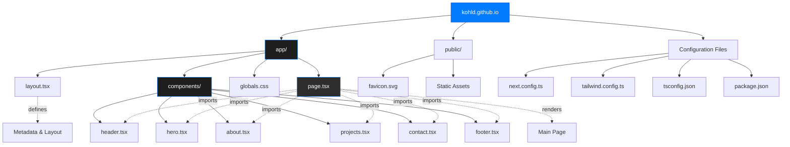

# Portfolio Website

[](https://github.com/kohld/kohld.github.io/actions/workflows/deploy.yml)

A modern, accessible portfolio website built with Next.js, featuring a professional project showcase, responsive design, and optimized user experience.

---

## Table of Contents
- [Features](#features)
- [Accessibility](#accessibility)
- [Technologies Used](#technologies-used)
- [Project Structure](#project-structure)
- [Getting Started](#getting-started)
- [License](#license)

---

## Features
- Professional project portfolio with detailed descriptions and technology stacks
- Responsive and mobile-friendly layout
- Accessible navigation and semantic markup
- Contact options (Email, GitHub)
- Collapsible project list for improved UX

## Accessibility
- Keyboard navigable and screen reader optimized
- ARIA labels and roles for all major components
- Skip to content and accessible navigation
- Color contrast and focus indicators

## Technologies Used
- [Next.js](https://nextjs.org/)
- [React](https://react.dev/)
- [Tailwind CSS](https://tailwindcss.com/)
- [TypeScript](https://www.typescriptlang.org/)

## Project Structure



---

## Getting Started

To run this project locally:

1. **Clone the repository**
    ```sh
    git clone https://github.com/kohld/kohld.github.io.git
    
    cd kohld.github.io
    ```
2. **Install dependencies**
    ```sh
    npm install
    ```
3. **Start the development server**
    ```sh
    npm run dev
    ```
4. **Open your browser** and visit [http://localhost:3000](http://localhost:3000)

---

## License

This project is licensed under the MIT License. See the [LICENSE](LICENSE) file for details.

